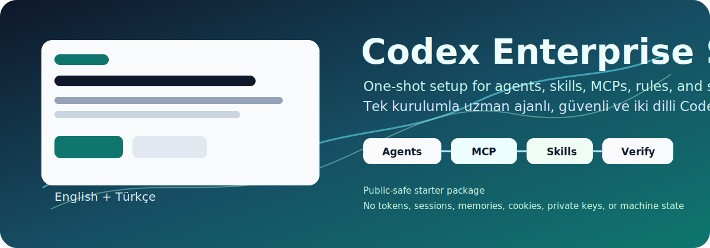
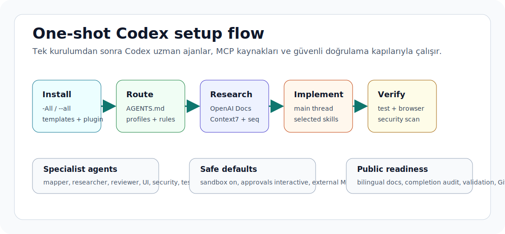

# Codex Enterprise Starter

<p align="center">
  
</p>

<p align="center">
  <a href="https://github.com/ucsahinn/codex-enterprise-starter/actions/workflows/validate.yml"></a>
  <a href="LICENSE"></a>
  <a href="README.tr.md"></a>
  
</p>

<p align="center">
  <a href="README.md">🇬🇧 English</a> | <a href="README.tr.md">🇹🇷 Türkçe</a>
</p>

A security-first Codex setup kit for Windows-first power users and small teams.
It turns a mature local Codex configuration into a clean, shareable repository:
global instructions, MCP defaults, specialist agents, approval rules, skill
catalogs, plugin packaging, validation scripts, and bilingual how-to docs.

Türkçe kısa özet: Bu repo Codex'i tek kurulumla uzman ajanları, MCP kaynakları,
güvenli onay/sandbox varsayılanları ve iki dilli kullanım rehberleri olan güçlü
bir çalışma alanına çevirir.

This is an unofficial community starter. It is not an OpenAI product, but it is
designed from official Codex documentation and keeps links to the official
source pages in the docs.

This repository does not include tokens, auth files, memories, sessions, local
project paths, private keys, cookies, or machine-specific state.

## ⚡ Start Fast

| I want to... | Go here |
| --- | --- |
| Install the full setup | [Quick Start](#-quick-start) |
| Understand the senior operating model | [docs/best-practices.md](docs/best-practices.md) |
| Decide whether something belongs in a prompt, AGENTS.md, config, skill, plugin, MCP, rule, or hook | [docs/codex-surfaces.md](docs/codex-surfaces.md) |
| Verify before push or release | [docs/verification.md](docs/verification.md) |
| Check public-safe readiness | [docs/public-readiness.md](docs/public-readiness.md) |

## 🧩 What It Installs

- `~/.codex/AGENTS.md` durable working agreements.
- `~/.codex/config.toml` with safe defaults, MCP servers, feature flags, and
  specialist agent registrations.
- `~/.codex/agents/*.toml` for focused code mapping, docs research, review,
  frontend verification, security audit, test verification, and release
  verification.
- `~/.codex/rules/default.rules` with narrow command approval rules.
- Optional global Git hygiene: ignore file plus a pre-commit hook that blocks
  obvious secrets and runs Gitleaks when available.
- Optional skill installation from verified public packages in
  `catalog/skills.json`.
- Offline and optional online skill-source verification so installable skills
  resolve as package/skill pairs, not plain repository names.
- A local plugin marketplace entry for the bundled
  `codex-enterprise-workflows` plugin.

## ⚡ Quick Start

Clone the repository anywhere, then run the installer from the repository root.

PowerShell:

```powershell
git clone https://github.com/ucsahinn/codex-enterprise-starter.git
cd codex-enterprise-starter
Set-ExecutionPolicy -Scope Process Bypass -Force
.\scripts\install.ps1 -All -Force
```

Bash or WSL:

```bash
git clone https://github.com/ucsahinn/codex-enterprise-starter.git
cd codex-enterprise-starter
chmod +x scripts/install.sh
./scripts/install.sh --all --force
```

After installation, restart Codex and run:

```bash
codex doctor --summary
codex --strict-config "Summarize the active Codex setup."
```

Use `-InstallSkills` / `--install-skills` or `-InstallGitGuards` /
`--install-git-guards` when you want only one part of the full setup.

## 🧭 How To Use It

Start with [docs/how-to.md](docs/how-to.md) for the day-to-day operating
model. The intended flow is:

1. Map unfamiliar code with `code_mapper`.
2. Verify current APIs and product behavior with `docs_researcher`.
3. Implement in the main thread with repo instructions and selected skills.
4. Run `test_verifier`, `frontend_verifier`, or `security_auditor` when the
   task shape calls for deeper evidence.
5. Use `release_verifier` before any push, tag, release, package, or deploy.

This makes the setup behave like a small specialist software team while keeping
the main Codex thread focused on decisions, implementation, and final evidence.

## 🎬 Visual Overview

<p align="center">
  
</p>

## 🛡️ Safe Defaults

- Sandbox stays enabled.
- Approval policy stays interactive.
- Agent network access stays off unless a profile or explicit approval enables it.
- Matching skills, specialist agents, MCPs, and config flags are required when
  the task shape calls for them.
- Authenticated remote connectors are disabled by default.
- MCPs that can touch external systems should prompt before risky tools.
- Delete, cleanup, prune, uninstall, overwrite, drop, and truncate actions stay
  approval-gated while safe non-destructive work can continue.
- GitHub push, release creation, deployment, secret rotation, package publishing,
  destructive file operations, and credential access remain approval-gated.

## ✅ Trust Signals

| Signal | Evidence |
| --- | --- |
| 🛡️ Public-safe by design | No tokens, auth files, sessions, memories, cookies, private keys, or machine-specific state are included. |
| ✅ Real validation | `npm run check` runs repository validation and security audit scripts. |
| 🌐 Bilingual docs | English and Turkish docs are paired and enforced by validation. |
| 🎬 Accessible animated visuals | SVG assets include `title`, `desc`, lightweight motion, reduced-motion fallback, and README alt text. |
| 🧪 Skill source gate | `npm run verify:skills` checks installable package/skill pairs before users hit installer failures. |
| 🔒 Conservative connectors | Authenticated account, database, and filesystem MCPs stay disabled until needed. |
| 🧭 Mandatory routing | Applicable skills, specialist agents, MCPs, and config flags must be used or the skipped route must be explained. |
| 🤝 Community flow | Issue and PR templates include public-safe reminders. |
| ♻️ Dependency hygiene | Dependabot tracks GitHub Actions and npm manifest updates. |

## 📁 Repository Layout

```text
.github/                 Validation workflow plus issue and PR templates
assets/                  Public-safe README visuals and diagrams
catalog/                 MCP and skill catalogs
docs/                    English and Turkish setup guides
plugins/                 Optional local Codex plugin package
scripts/                 Install and validation scripts
templates/codex/         Files copied into ~/.codex
templates/git/           Optional global Git hygiene files
```

## 🔎 What Was Found Locally

The previous global Codex work changed the live user setup, not a new Desktop
repository. The important current-state locations were:

- `~/.codex/AGENTS.md`
- `~/.codex/config.toml`
- `~/.codex/SECURITY_OPERATIONS.md`
- `~/.codex/agents/*.toml`
- `~/.codex/rules/default.rules`
- `~/.agents/skills/*`
- `~/.gitignore_global`
- `~/.githooks/pre-commit`

See [docs/local-audit.md](docs/local-audit.md) for the normalized audit.

## 🚀 Publishing To GitHub

This repository is designed to be pushed after validation, but the installer's
job is local setup only. It does not create remotes, commit, push, publish,
deploy, or open pull requests.

Before pushing:

```bash
npm run check
git status --short
git diff --cached
```

If Gitleaks is installed:

```bash
gitleaks detect --redact --no-banner --no-git --verbose
```

## 📚 Official Codex References

The docs in this repo are based on the current Codex manual fetched on
2026-06-11 and local configuration evidence. Start with:

- Codex CLI reference: https://developers.openai.com/codex/cli/reference
- AGENTS.md guidance: https://developers.openai.com/codex/guides/agents-md
- Skills: https://developers.openai.com/codex/skills
- MCP: https://developers.openai.com/codex/mcp
- Rules: https://developers.openai.com/codex/rules
- Hooks: https://developers.openai.com/codex/hooks
- Permissions: https://developers.openai.com/codex/permissions
- Plugins: https://developers.openai.com/codex/plugins
- Windows: https://developers.openai.com/codex/windows

## 🧾 Public Readiness

See:

- [docs/how-to.md](docs/how-to.md)
- [docs/best-practices.md](docs/best-practices.md)
- [docs/completion-audit.md](docs/completion-audit.md)
- [docs/verification.md](docs/verification.md)
- [docs/public-readiness.md](docs/public-readiness.md)
- [SECURITY.md](SECURITY.md)
- [SUPPORT.md](SUPPORT.md)
- [CONTRIBUTING.md](CONTRIBUTING.md)

Issue and PR templates are included under `.github/` so bug reports,
documentation suggestions, and pull requests start with public-safe checks.
